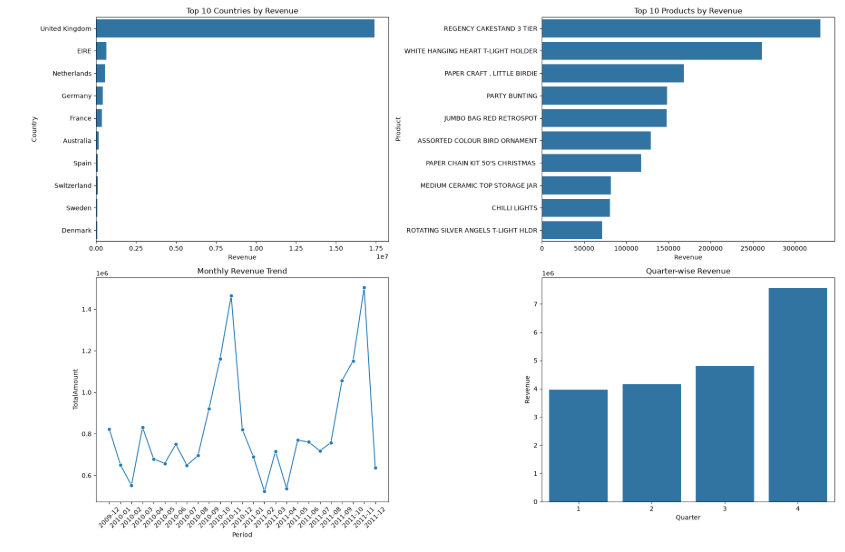
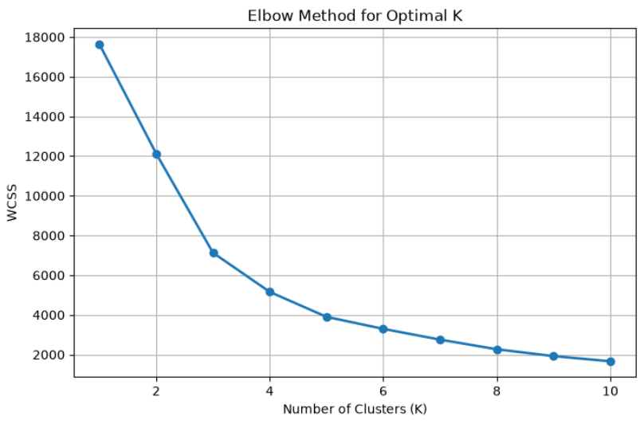
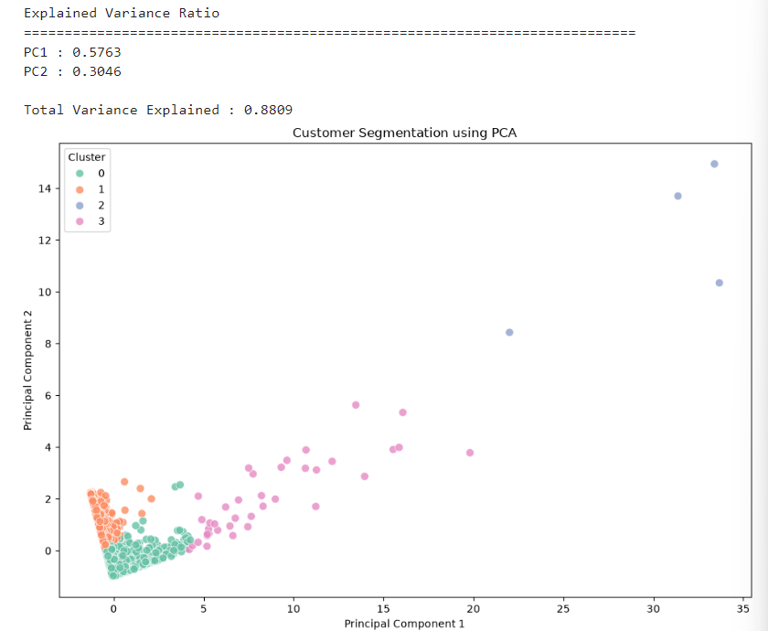
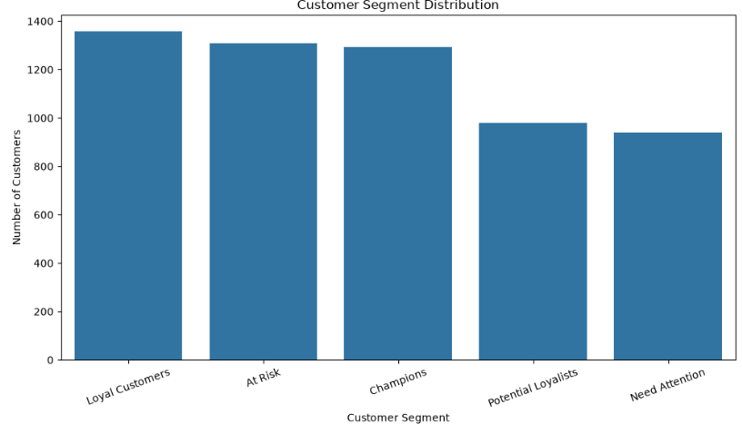
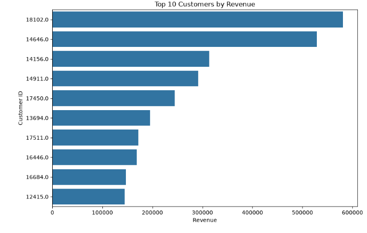

# 🛒 Smart Retail Analytics & Customer Segmentation Platform

> **End-to-End Machine Learning Project | Retail Analytics | Customer Segmentation | Market Basket Analysis**

---

## 📌 Project Overview

This project presents a complete **End-to-End Retail Analytics and Customer Segmentation Platform** developed using the **Online Retail II Dataset**.

The project focuses on understanding customer purchasing behavior, identifying high-value customers, discovering purchasing patterns, and generating actionable business insights using Data Analytics and Machine Learning techniques.

---

## 🎯 Project Objectives

- Clean and preprocess retail transaction data
- Perform feature engineering for business analysis
- Analyze sales and customer behavior
- Segment customers using RFM Analysis
- Build customer clusters using Machine Learning
- Discover product associations using Market Basket Analysis
- Generate business recommendations for customer retention and sales growth

---

## 📂 Dataset

**Dataset:** UCI Online Retail II Dataset (2009–2011)

**Domain:** Retail Analytics

**Type:** Transactional Dataset

Dataset contains retail transactions including:

- Invoice Number
- Product Description
- Quantity
- Invoice Date
- Unit Price
- Customer ID
- Country

---

# 🔄 Project Workflow

```
Data Collection
        │
        ▼
Data Cleaning
        │
        ▼
Feature Engineering
        │
        ▼
Business KPI Analysis
        │
        ▼
Exploratory Data Analysis
        │
        ▼
RFM Analysis
        │
        ▼
Customer Segmentation
        │
        ▼
Machine Learning
(K-Means, DBSCAN, Hierarchical Clustering)
        │
        ▼
Principal Component Analysis (PCA)
        │
        ▼
Market Basket Analysis
(Apriori & FP-Growth)
        │
        ▼
Business Insights & Recommendations
```

---

# 🛠️ Technologies Used

- Python
- Pandas
- NumPy
- Matplotlib
- Seaborn
- Scikit-learn
- MLxtend
- Jupyter Notebook

---

# 🤖 Machine Learning Techniques

- RFM Analysis
- K-Means Clustering
- DBSCAN Clustering
- Hierarchical Clustering
- Principal Component Analysis (PCA)
- Apriori Algorithm
- Association Rule Mining
- FP-Growth Algorithm

---

# 📊 Business Analysis

The project includes:

- Revenue Analysis
- Customer Analysis
- Country-wise Sales Analysis
- Product Performance Analysis
- Monthly Sales Trend
- Customer Segmentation
- Market Basket Analysis

---

# 📈 Key Results

- Successfully segmented customers into meaningful groups.
- Identified VIP, High Value, Regular, and At-Risk customers.
- Discovered frequently purchased product combinations.
- Generated actionable business insights for customer retention and cross-selling.
- Demonstrated end-to-end Retail Analytics workflow using Machine Learning.

---

# 🚀 Skills Demonstrated

- Data Cleaning
- Data Preprocessing
- Feature Engineering
- Exploratory Data Analysis (EDA)
- Business Analytics
- Data Visualization
- Customer Segmentation
- Machine Learning
- Clustering
- Market Basket Analysis
- Association Rule Mining

---

# 📁 Project Structure

```
smart-retail-analytics-customer-segmentation/

│── Smart-Retail-Analytics-&-Customer-Segmentation-Platform.ipynb
│── README.md
│── requirements.txt
│── LICENSE
│── Images/
└── Dataset/
```

---

# ⚙️ Installation

```bash
git clone https://github.com/YOUR_USERNAME/smart-retail-analytics-customer-segmentation.git
```

```bash
cd smart-retail-analytics-customer-segmentation
```

```bash
pip install -r requirements.txt
```

```bash
jupyter notebook
```

---

# 💼 Business Recommendations

- Focus on VIP and High-Value customers.
- Re-engage At-Risk customers with personalized campaigns.
- Create product bundles using Association Rules.
- Improve inventory planning based on purchasing patterns.
- Use customer segmentation for targeted marketing.

---

# 🚀 Future Scope

- Power BI Dashboard
- Streamlit Web Application
- Customer Lifetime Value Prediction
- Recommendation System
- Deep Learning-based Personalization

---

## 📸 Business Dashboard



---

## 📈 Elbow Method



---

## 🤖 PCA Customer Segmentation



---

## 👥 RFM Customer Segments



---

## 💰 Top Customers by Revenue



---

# 👨‍💻 Author

**Sandeep Vyas**

Aspiring Data Scientist | Machine Learning Enthusiast

---

## ⭐ If you found this project useful, please consider giving it a Star.
